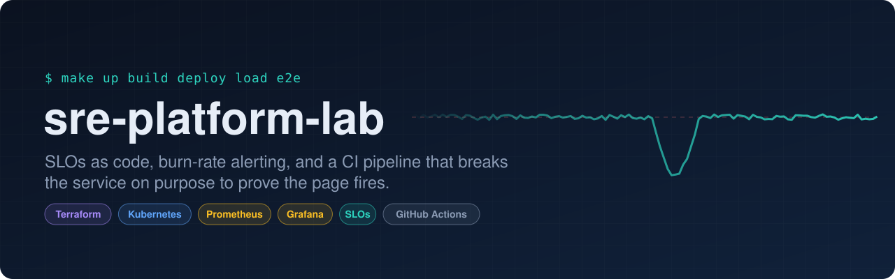
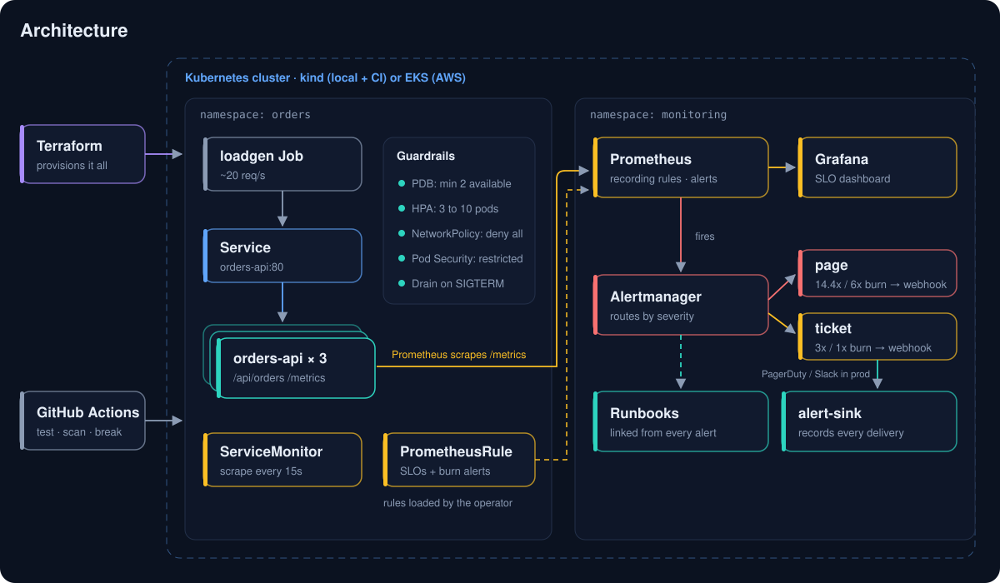
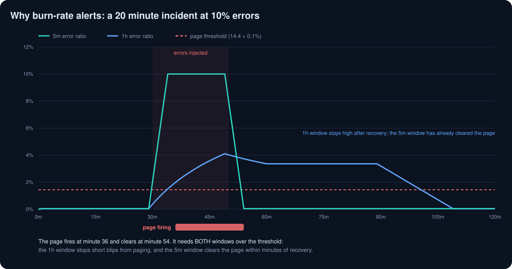

<p align="center">
  
</p>

<p align="center">
  <a href="https://github.com/rahmathekmat/sre-platform-lab/actions/workflows/ci.yml"></a>
  
  
  
  
  
</p>

<p align="center">
  <a href="#what-it-does">What it does</a> ·
  <a href="#architecture">Architecture</a> ·
  <a href="#slos-and-alerting">SLOs</a> ·
  <a href="#run-it-locally">Run it</a> ·
  <a href="#game-day">Game day</a> ·
  <a href="#design-decisions">Design decisions</a>
</p>

## What it does

A small web service (`orders-api`) run the way production services should be run. The app is deliberately boring. Everything interesting is the platform around it:

> **Define what "reliable" means, alert only when that promise is actually at risk, and prove the alerting works by breaking things on purpose.**

| | |
|---|---|
| **Builds the platform** | Terraform creates a Kubernetes cluster (kind locally, or a production-shaped VPC + EKS on AWS) and installs Prometheus, Alertmanager and Grafana. |
| **Runs the service safely** | Three replicas spread across nodes, health probes, graceful shutdown, a disruption budget, autoscaling, default-deny networking and restricted pod security. |
| **Defines SLOs as code** | 99.9% of requests succeed and 99% finish in under 300ms, measured over 30 days. |
| **Alerts on error budget burn** | Multiwindow, multi-burn-rate alerts from the Google SRE Workbook: page for real outages, ticket for slow leaks, silence for blips. |
| **Tests the alerts** | Every alert has `promtool` unit tests and a runbook. |
| **Breaks itself in CI** | Every push deploys to a real cluster, injects 50% errors and fails the build unless the page fires **and is delivered** through Alertmanager to a webhook receiver, then checks the service recovers after rollback. |
| **Scans itself** | Trivy fails the build on fixable CRITICAL/HIGH CVEs in the image and on HIGH/CRITICAL Kubernetes misconfigurations. Dependabot keeps Python, Actions, Terraform and the base image current. |

## Architecture

<p align="center">
  
</p>

| Path | What's there |
|---|---|
| [`app/`](app) | `orders-api` in Python: Prometheus metrics, fault injection, graceful drain, 11 tests |
| [`terraform/`](terraform) | `envs/local` (kind), `envs/aws` (VPC over 3 AZs + EKS), shared `modules/observability` |
| [`k8s/base/`](k8s/base) | Deployment, Service, PDB, HPA, NetworkPolicy, ServiceMonitor, PrometheusRule, Grafana dashboard |
| [`k8s/alert-sink/`](k8s/alert-sink) | Webhook receiver that stands in for PagerDuty locally and in CI, so delivery can be asserted |
| [`observability/`](observability) | kube-prometheus-stack values, `promtool` alert tests |
| [`docs/`](docs) | [SLOs](docs/slo.md), [game day](docs/gameday.md), [runbooks](docs/runbooks), [AWS guide](docs/aws.md) |
| [`.github/workflows/`](.github/workflows/ci.yml) | Lint, unit tests, alert tests, schema validation, Terraform validate, Trivy scans, end to end on kind |

## SLOs and alerting

| SLI | Target | Page when | Ticket when |
|---|---|---|---|
| **Availability:** `/api/orders` requests that aren't 5xx | 99.9% / 30d | burn over 14.4x (1h and 5m) or 6x (6h and 30m) | burn over 3x (1d and 2h) or 1x (3d and 6h) |
| **Latency:** `/api/orders` requests under 300ms | 99% / 30d | burn over 14.4x (1h and 5m) | |

<p align="center">
  
</p>

A plain "error rate above 1% for 5 minutes" alert either pages on every short spike or misses a slow leak that quietly spends the month's budget. Pairing a long window with a short one pages quickly on a real outage and clears quickly after recovery. Full reasoning in [docs/slo.md](docs/slo.md).

## Run it locally

Needs Docker, kind, kubectl, Terraform and Python 3.11+.

```bash
make up        # kind cluster (1 control plane, 2 workers) + monitoring stack via Terraform
make build     # build the image and load it into kind
make deploy    # orders-api, SLO rules, dashboard
make load      # start synthetic traffic
make e2e       # the same end to end checks CI runs, including the game day

kubectl -n monitoring port-forward svc/kube-prometheus-stack-grafana 3000:80
# http://localhost:3000  admin / sre-lab-admin  →  "orders-api / SLO overview"

make down
```

No cluster needed for these:

```bash
make test        # ruff + pytest
make test-rules  # promtool check and unit tests for the alerts
make lint-k8s    # kustomize build | kubeconform
make tf-check    # terraform fmt + validate
make scan-config # trivy misconfiguration scan (k8s blocking, terraform advisory)
```

## Game day

[docs/gameday.md](docs/gameday.md) has four experiments, each with a hypothesis, the command, what to watch and what "pass" looks like:

| Experiment | Command | Expected |
|---|---|---|
| Error spike | `bash scripts/gameday.sh errors 0.1` | Fast burn page fires within minutes and clears after recovery |
| Latency regression | `bash scripts/gameday.sh latency 400` | Latency page fires, availability alerts stay quiet |
| Pod failure | `bash scripts/gameday.sh kill-pod` | Zero failed requests while the pod is replaced |
| Node drain | `bash scripts/gameday.sh drain-node` | PDB keeps at least 2 pods serving throughout |

CI runs a version of the first experiment on every push, and goes one step further: it checks that Alertmanager delivered the page to the webhook receiver, not just that Prometheus evaluated it. A broken route, receiver or network policy fails the build.

## Design decisions

- **Delivery is tested, not assumed.** Most setups verify that an alert *fires*. This one also verifies it *arrives*: Alertmanager routes `page` and `ticket` to a webhook receiver (`alert-sink`) that CI queries. Swapping the receivers for PagerDuty and Slack in production is a values change, shown inline in [the values file](observability/kube-prometheus-stack.values.yaml).
- **Every request carries an id.** `X-Request-ID` is honoured or minted, echoed to the client and logged with route, status and latency, so a user report can be matched to a log line.
- **One source of truth for alert rules.** The `PrometheusRule` in `k8s/base` is what gets deployed. CI extracts its `.spec` and runs the `promtool` tests against it, so tested and deployed rules can't drift.
- **One values file for the monitoring stack**, shared by Terraform (local and EKS) and CI. EKS adds persistent storage and longer retention on top.
- **Graceful shutdown.** On SIGTERM the app fails readiness first, waits for endpoints to update, then stops, so rolling deploys don't drop requests. Liveness stays green while draining so the kubelet doesn't kill a pod that is shutting down cleanly.
- **Bounded metric cardinality.** Unknown paths are recorded as `route="unmatched"`, so a scanner can't create unlimited time series.
- **Rollouts never reduce capacity:** `maxUnavailable: 0`, `maxSurge: 1`, PDB of 2 out of 3.

## Roadmap

- [ ] Canary releases with Argo Rollouts, gated on burn rate
- [ ] Tracing with OpenTelemetry
- [x] Real Alertmanager receivers, with delivery asserted in CI
- [ ] Apply the AWS environment from CI with OIDC and an approval step

## License

[MIT](LICENSE) © Rahmat Hekmat
